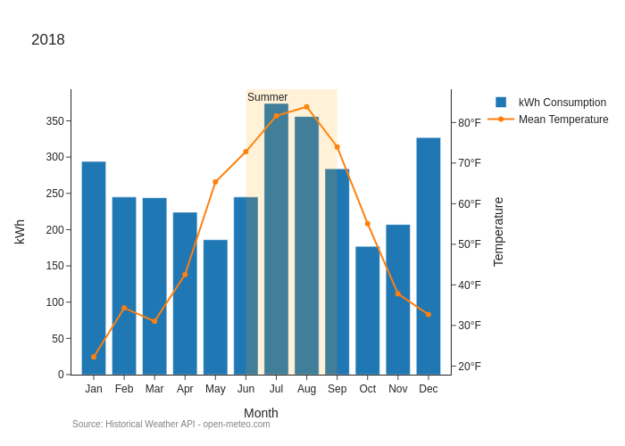
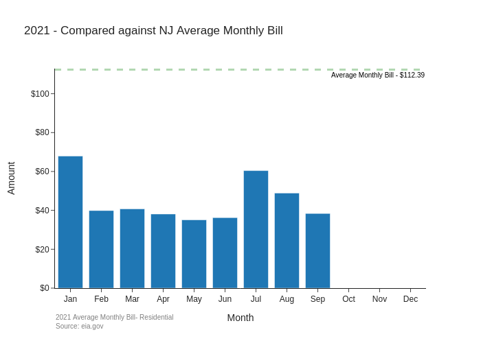

# Jersey Central Power & Light (JCP&L) Electricity Usage: An Analysis
View the Jupyter notebook: [jcpl-electricity-analysis.ipynb](//github.com/christianmendoza/jcpl-electricity-analysis/blob/main/jcpl-electricity-analysis.ipynb)

Using [pandas](https://pandas.pydata.org/) and [plotly.express](https://plotly.com/python/plotly-express/) to analyze my JCP&L electrity bills and usages from January 2016 through September 2021.

- Personal dataset exported from Google Sheets
- Historical Weather API: [Open-Meteo](https://open-meteo.com/), [dataset](https://open-meteo.com/en/docs/historical-weather-api#api_form)
- 2021 Average Monthly Residential Bill: [U.S. Energy Information Administration](https://www.eia.gov/), [dataset](https://www.eia.gov/electricity/sales_revenue_price/pdf/table5_a.pdf)
- 2021 Utility Bundled Sales to Residential Customers: [U.S. Energy Information Administration](https://www.eia.gov/), [dataset](https://www.eia.gov/electricity/sales_revenue_price/pdf/table6.pdf)